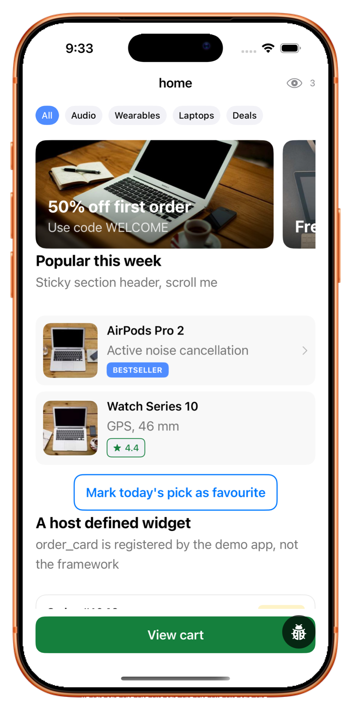
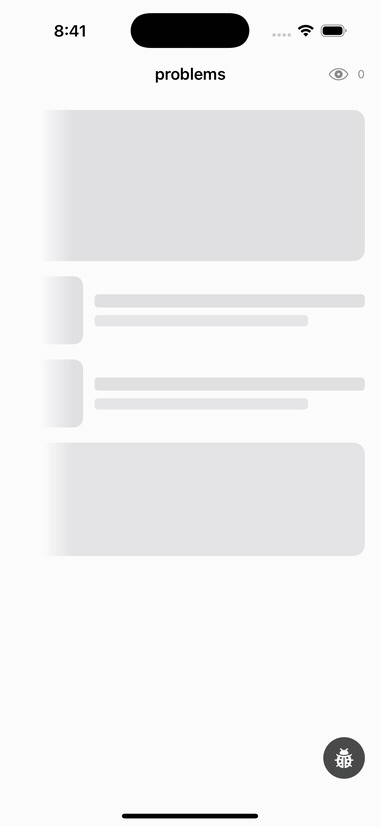
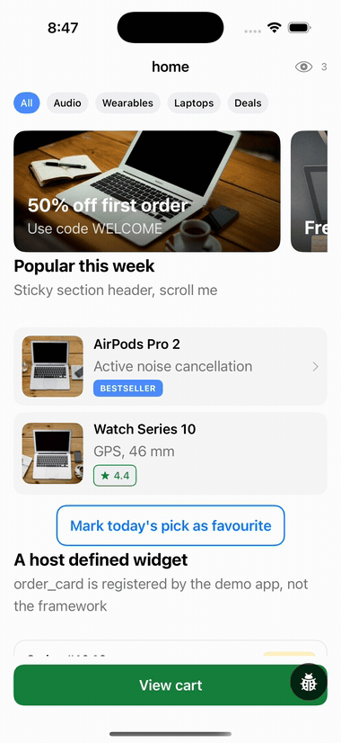
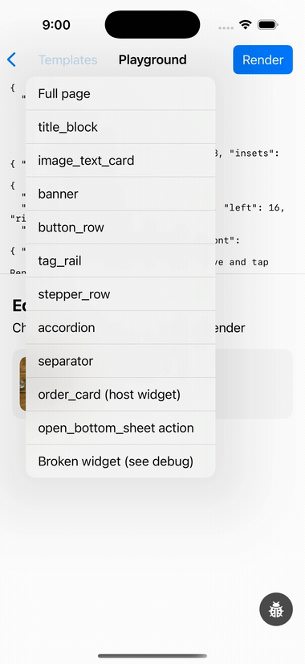
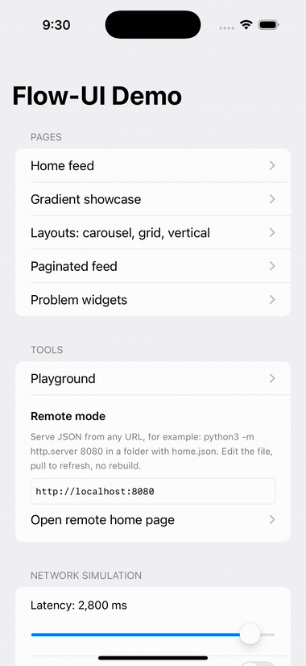

<div align="center">

<picture>
  <source media="(prefers-color-scheme: dark)" srcset=".github/assets/hero-dark.svg">
  
</picture>

<!-- One source line on purpose: a line break between badges makes GitHub stack them. -->
[](https://github.com/ayushmishracognitain/FlowUI/actions/workflows/ci.yml) [](https://swift.org) [](https://developer.apple.com) [](https://swift.org/package-manager) [](LICENSE)

</div>

**Server driven UI for SwiftUI.** Ship a new screen without shipping a new build.
The backend describes pages, sections and widgets as JSON; Flow-UI decodes it, lays
it out, renders it as native SwiftUI, and routes every interaction back to your code.

A server driven UI (SDUI) framework for iOS 17 and later, free and MIT licensed. No
networking stack, no image library, no design system. Those are seams your app plugs
into.

<div align="center">
  <picture>
    <source media="(prefers-color-scheme: dark)" srcset=".github/assets/device-dark.png">
    
  </picture>
</div>

## See it work

<table>
<tr>
<td width="50%" valign="top" align="center">
  
  <br><br><b>One bad widget never blanks a screen</b>
  <br><sub>Unknown types and malformed payloads become labelled cards. The debug console names the exact key path.</sub>
</td>
<td width="50%" valign="top" align="center">
  
  <br><br><b>Update one widget, not the page</b>
  <br><sub>A tap sends an <code>api</code> action, the backend answers with a mutation, the card swaps in place.</sub>
</td>
</tr>
<tr>
<td width="50%" valign="top" align="center">
  
  <br><br><b>Paste JSON, see the screen</b>
  <br><sub>The demo ships a playground that renders anything you give it, including your own widgets.</sub>
</td>
<td width="50%" valign="top" align="center">
  
  <br><br><b>Loading states are not an afterthought</b>
  <br><sub>Shimmer, skeletons and placeholder colours are built in and toggled from the payload.</sub>
</td>
</tr>
</table>

## Installation

Swift Package Manager. In Xcode: **File > Add Package Dependencies**, and paste the
repository URL. Or in your `Package.swift`:

```swift
dependencies: [
    .package(url: "https://github.com/ayushmishracognitain/FlowUI.git", from: "1.0.0")
]
```

| Product | Take this when |
| --- | --- |
| `FlowUI` | You are building an app. Schema, renderer and the starter widgets. |
| `FlowRender` | You want the renderer without the starter widget library. |
| `FlowCore` | Schema only. Foundation, no SwiftUI, so it runs in backend tooling and tests. |

Requires Xcode 16 or newer: the package builds in the Swift 6 language mode.

## Quick start

```swift
import FlowUI

// 1. Register widgets once at startup.
let registry = WidgetRegistry()
FlowWidgets.register(on: registry)          // the starter library
registry.register(OrderCardWidget.self)     // your own widgets

// 2. Implement PageLoader with whatever networking you already have.
struct APILoader: PageLoader {
    func loadPage(_ request: PageRequest) async throws -> Data {
        try await myClient.fetch("/pages/\(request.pageID)")
    }
}

// 3. Render.
let store = PageStore(pageID: "home", loader: APILoader(), registry: registry)
FlowPageView(store: store)
```

UIKit hosts use `FlowHostingController(store:)` instead of `FlowPageView`.

## The JSON contract

A page is sections of widgets. Every widget carries a `type`, an optional `id`,
backend controlled `layout` chrome, its `data` payload, declarative `actions`
and opaque `tracking`.

```jsonc
{
  "page": {
    "id": "home",
    "sections": [
      {
        "layout": { "arrangement": "vertical", "item_spacing": 8 },
        "widgets": [
          {
            "type": "image_text_card",
            "layout": { "margin": { "left": 16, "right": 16 }, "corner_radius": 12,
                        "background": { "hex": "#F8F8F8", "dark_hex": "#1C1C1E" } },
            "data": { "title": "AirPods Pro 2" },
            "actions": { "tap": { "type": "open_bottom_sheet", "sheet": { "...": "..." } } }
          }
        ]
      }
    ]
  }
}
```

See [SCHEMA.md](SCHEMA.md) for the full contract with copy ready examples, and
[ADDING_A_WIDGET.md](ADDING_A_WIDGET.md) for the three step recipe to add your own
widget.

## What you get

- **Open widget registry.** One call connects the backend `type` string, its payload
  model and its SwiftUI view. Adding a widget never touches framework code.
- **Backend controlled chrome.** Margins, padding, corner radii, backgrounds,
  gradients, borders and widths come from the JSON and are applied by one layout
  modifier, so widgets never style their own containers.
- **Pages that refuse to die.** Unknown types and malformed payloads are contained,
  bad array elements are dropped rather than fatal, and every problem is recorded in
  diagnostics with an exact key path.
- **Actions as data.** Taps, long presses and change events carry declarative actions
  (`toast`, `dismiss`, `refresh_page`, `open_bottom_sheet`, `api`, or anything you
  define) routed through an extensible handler chain. Deeplinks stay yours.
- **Accessible by default.** A backend declared tap is announced as a button with a
  real activation action, images carry `alt`, and backend font sizes scale with
  Dynamic Type.
- **Impressions as a seam.** Widgets carry an opaque `tracking` object. Implement
  `FlowTrackingSink` and it arrives, dwell debounced, with your schema untouched.

## Modules

| Module | What it holds |
| --- | --- |
| `FlowCore` | The schema: atoms, envelopes, actions, forgiving decode pipeline. Foundation only. |
| `FlowRender` | SwiftUI: registry, page and sheet renderers, layout modifier, atoms, action dispatch, theming, debug console. |
| `FlowWidgets` | Eight starter widgets, each one a worked example. |

## The demo app

`Examples/FlowDemo` is the living catalog, and every clip above was recorded from
it: fixture driven pages for each layout, pagination, sheets and api mutations, the
JSON playground, remote mode for serving JSON from a local http server with no
rebuild, and network simulation for exercising shimmer, error and empty states. The
floating debug console shows decode diagnostics with exact key paths, the action log
and a layout inspector.

## Testing

```
swift test
swiftlint --strict
```

`FlowCore` is UI free and covered by fixture based decode tests; `FlowWidgets` has
its own suite for the starter payloads.

## Contributing

Issues and pull requests are welcome, and you do not need permission to start.
`main` only moves through a reviewed pull request, never a direct push. Bug
reports are easiest with the JSON payload that reproduces the problem: the playground
in the demo app renders anything you paste.

Conventions, the four gates a pull request has to pass, and how to add a widget are
in [CONTRIBUTING.md](CONTRIBUTING.md). Participation is covered by the
[Code of Conduct](CODE_OF_CONDUCT.md). Vulnerabilities go through
[SECURITY.md](SECURITY.md), not a public issue. Changes are listed in
[CHANGELOG.md](CHANGELOG.md).

## Author

Built by [Ayush Mishra](https://www.cognitain.in/ayushmetaverse).

## License

Flow-UI is free and open source under the MIT licence. Use it in commercial apps, fork
it, or build on top of it. There is no paid tier and no licence key. See
[LICENSE](LICENSE).
